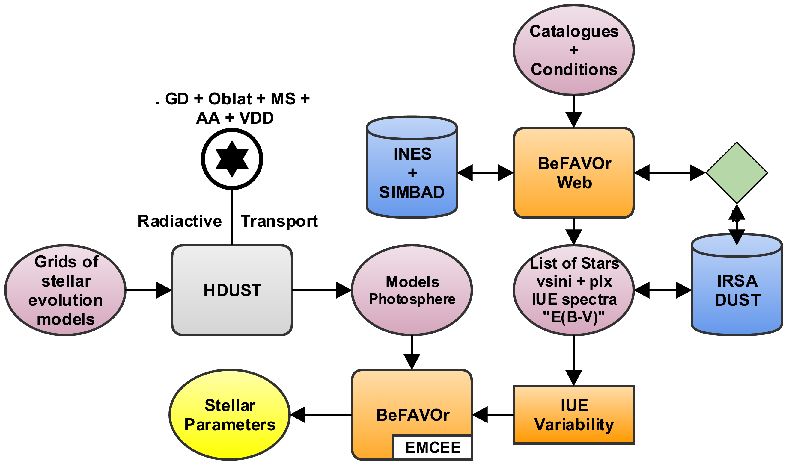

.. BeFaVOr_web documentation master file, created by
   sphinx-quickstart on Tue Aug 23 21:46:12 2016.
   You can adapt this file completely to your liking, but it should at least
   contain the root `toctree` directive.

Project Report: "Be-FaVOR: Be Stars - Facilities in VO Research. Uma ferramenta para a determinação de parâmetros de estrelas Be"
*********************************************************************************************************************************
O Observatório Astronômico Virtual (VO) é uma iniciativa internacional liderada pela *International Virtual Observatory Alliance* (IVOA), que visa integrar, através de ferramentas interoperacionais, diferentes bancos de dados e diferentes serviços no sentido de modelos, ferramentas de análise e outros.

Neste contexto, nosso trabalho visa disponibilizar uma ferramenta de análise *online* que proporcionará uma interface de integração entre o usuário e ferramentas desenvolvidas pelo grupo de pesquisa Beacon, coordenado pelo professor Dr. Alex C. Carciofi. 

Esta ferramenta *online* irá permitir ao usuário estimar as propriedades fundamentais básicas de estrelas Be clássicas a partir de dados fotométricos. A base para esta ferramenta são os dados disponíveis em inúmeras bases de dados do VO, bem como os códigos HDUST de transferência radiativa e o código EMCEE de minimização de múltiplos parâmetros.

Introdução
==========
Apesar de terem sido descobertas há 150 anos por Secchi 1866, estrelas Be continuam sendo verdadeiros enigmas. Estrelas Be clássicas são estrelas que apresentam a maior taxa de rotação entre as estrelas da Sequência Principal (Rivinius, Carciofi & Martayan (2013)). Hoje, há consenso na comunidade de que a alta taxa de rotação está na base do surgimento dos efeitos peculiares apresentados por estas estrelas.

Um dos problemas centrais no estudo de estrelas do tipo Be é a obtenção de parâmetros fundamentais da estrela, tais como massa, idade, taxa de rotação e inclinação. Suas características particulares tornam essa tarefa difícil: estrelas Be são achatadas em seus polos, apresentam efeito de escurecimento gravitacional e, quando vistas de ângulos diferentes, apresentam distribuições espectrais de energia (SED) com diferentes características. A característica mais marcante, entretanto, é a presença de um disco circunstelar que altera de forma significativa o espectro estelar. 

Buscando uma solução para este problema, o presente projeto visa disponibilizar à comunidade uma ferramenta no formato de um *web service*, isto é, um serviço de Observatório Virtual, ligado à infraestrutura do BRAVO - *Brazilian Virtual Observatory*. O método a ser utilizado por esta ferramenta baseia-se no confronto entre grades de modelos fotosféricos que levam em consideração a rotação e espectros da missão IUE, retornando dados confiáveis com estimativa de erro robusta de parâmetros estelares de uma dada lista de estrelas. 

.. toctree::
   :maxdepth: 2
   BeFaVOr_web
   take_vizier_data

Dados Observacionais
====================

Os dados do IUE
---------------
A missão *International Ultraviolet Explorer* (IUE) foi um projeto conjunto entre NASA, ESA e PPARC. Ainda hoje este projeto é entendido como um dos telescópios astronômicos mais produtivos de todos os tempos, ultrapassando as expectativas de seus objetivos originais, dentre estes, a obtenção de espectros de alta resolução de estrelas de todos os tipos espectrais para determinar suas características físicas e fazer repetidas observações de objetos com espectros variáveis.

Os arquivos de espectros do IUE podem ser acessados no sistema da ESA chamado IUE *Newly Extracted Spectra* (INES), cujo objetivo é fornecer à comunidade científica acesso aos espectros do IUE sem que se faça necessário um conhecimento técnico dos instrumentos. Para informações detalhadas sobre o sistema, veja http://sdc.cab.inta-csic.es/ines.

O *Web Service*
---------------
A ferramenta em desenvolvimento utilizará como *input* o nome de uma estrela para automaticamente baixar os dados do repositório *online* do INES e de outros serviços disponíveis e graficá-los de forma pré-derterminada. Desta maneira, não será necessário o usuário baixar os dados das estrelas que deseja estudar em seu computador, selecioná-los e, então, enviá-los de volta ao servidor para serem analisados; bastará apenas selecionar os espectros com os quais deseja trabalhar.

Para construir esta ferramenta, o projeto foi dividido em duas etapas: 

1. Elaboração de uma rotina capaz de ler os dados observacionais diretamente através do servidor.

	Esta rotina é a responsável por fazer o *download* automático dos dados buscando no servidor pelo nome da estrela.

2. Implementação da rotina Python de determinação dos parâmetros estelares.

	Esta parte inclui a criação de uma interface que permita ao usuário executar as rotinas de interesse dentro de um ambiente de VO.

Este serviço será hospedado na *homepage* do grupo Beacon, ao lado de outro projeto que visamos integrar ao BRAVO, o BEATLAS (Faes et al. 2017 in prep.), ferramenta que colocará à disposição da comunidade cerca de 70.000 espectros sintéticos de estrelas Be.

Ferramentas
===========

Nesta seção, são descritas as rotinas Python criadas para leitura dos dados através do servidor: BeFaVOR-Web e TAKE-VIZIER-DATA. Esta última trata-se de uma rotina complementar para habilitar a primeira a buscar por múltiplas estrelas de uma vez.

BeFaVOR-Web
-----------
A rotina BeFaVOR-Web usa como *input* tanto o nome de uma única estrela quanto uma lista de estrelas para realizar uma busca por arquivos de espectros correspondentes no *database* do sistema INES, salvando-os na pasta definida. Em seguida, realiza-se, para a mesma estrela, uma busca no SIMBAD, através do qual obtemos os parâmetros: paralaxe, vsini e suas respectivas incertezas, além da referência bibliográfica para vsini. Também é verificado se a busca na plataforma IRSA-*Galactic DUST Reddening & Extinction* retorna algum valor de avermelhamento E(B-V) para aquela estrela. Caso positivo, o valor é salvo juntamente com os outros parâmetros em uma tabela na pasta definida.

Instalação
++++++++++
Para utilizar esta rotina em sua atual versão é preciso ter instalados os seguintes pacotes:

	1. numpy

	2. bs4

	3. datetime

	4. requests

	5. selenium

	6. astroquery

	7. pyhdust

	8. matplotlib

    9. urllib

    10. re

    11. random

    12. tafile

Os pacotes numerados de 1 a 8 podem ser instalados utilizando o gerenciador de pacotes **pip**, enquanto aqueles de 9 a 12 podem ser instalados pelo comando **apt-get install python3-pacote**.

Executando a BeFaVOR-Web
++++++++++++++++++++++++
Para rodar a rotina o usuário deve primeiro definir o *path* onde esta encontra-se instalada na tag **commum_folder**, bem como o *path* onde as tabelas serão salvas em **folder_tables**. Recomenda-se utilizar a versão mais atual disponível do Python.

Utilizando como exemplo o IPython 3.0, o código pode ser rodado seguindo os seguintes passos:

	1. Abra o terminal e digite o comando:  ipython3

	2. Vá ao diretório em que a rotina encontra-se instalada;

	3. No terminal, digite o comando:   run BeFaV0r_web.py

	4. A rotina perguntará se o usuário deseja buscar apenas um ou vários alvos. Digite '1' para buscar um único alvo ou 'more' para buscar múltiplos alvos;

	5. Caso tenha digitado '1', a rotina perguntará o nome do alvo. Digite o nome da estrela desejada;

	6. Caso tenha digitado 'more' a rotina executará a rotina complementar TAKE_VIZIER_DATA que baixará uma série de alvos de acordo com um catálogo pré-definido. Para mais detalhes, veja a descrição da rotina TAKE_VIZIER_DATA na sub-seção seguinte. 

Se o usuário tiver buscado por um único alvo, além dos espectros do IUE salvos, a rotina criará um documento de texto com a seguinte estrutura de **linhas**:

	1. Nome da estrela
	2. Paralaxe
	3. Incerteza da paralaxe
	4. vsini
	5. Incerteza do vsini
	6. "Bump"
	7. Referência bibliográfica do vsini
	8. E(B-V)

"Bump" refere-se à presença de um espectro IUE que cobre a região conhecida como *bump* 2200 Angstron que é utiliza na determinação do valor de E(B-V). Caso retorne "*True*", existe este espectro e, caso retorne "*False*", significa que o espectro não cobre esta faixa espectral e, portanto, o valor é retirado do IRSA.

Se o usuário tiver buscado por múltiplos alvos, além dos espectros do IUE salvos, a rotina criará um documento de texto com uma estrutura de **colunas** pré-determinada pelo usuário. Por exemplo, caso o usuário selecione estrelas do *Bright Star Catalogue*, é possível gerar a seguinte estrutura:

	1. Nome da estrela
	2. Índice B-V
	3. Índice U-B
	4. Índice R-I
	5. vsini
	6. Incerteza B-V
	7. Incerteza U-B
	8. Incerteza vsini
	9. Incerteza R-I
	10. Data de observação
	11. Tipo espectral

Funções da rotina BeFaVOR-Web
+++++++++++++++++++++++++++++

Segue a descrição das funções contidas na rotina BeFaVOR-Web, organizadas em ordem alfabética:

.. automodule:: BeFaVOr_web
   :members:

TAKE-VIZIER-DATA
----------------
A rotina TAKE-VIZIER-DATA realiza uma busca por catálogos no VizieR. Em seguida, dentro de cada catálogo selecionado, é feita a seleção dos objetos de interesse através de um processo de filtragem por tipo espectral, classe de luminosidade e existência ou não de dados da missão IUE. Deste ponto em diante, a rotina segue os seguintes passos:

	1. As estrelas selecionadas no VizieR são buscadas no arquivo do INES; 
	2. Os espectros daquelas encontradas são salvos no diretório definido;
	3. Para cada estrela encontrada no INES, é criado um documento de texto onde são salvos os parâmetros retirados do SIMBAD e (opcional) os parâmetros obtidos dos catálogos lidos por meio do VIZIER.

Detalhes sobre as funções contidas nesta rotina podem ser vistos no anexo do capítulo 6.

Outras Atividades e Perspectivas
================================

Atividades complementares
-------------------------
Ao longo do período de duração desta bolsa, além das tarefas diretamente relacionadas a este projeto, também foram realizadas atividades importantes para o desenvolvimento acadêmico, dentre elas destacamos:

	1. Participação de reuniões semanais do grupo Beacon, onde são discutidos resultados recentes das pesquisas de seus membros, bem como artigos científicos relevantes para nossa linha de pesquisa;
	2. Apresentação de resultados parciais deste projeto na reunião de grupo;
	3. Participação de observações astronômicas tanto remotas quanto presenciais no Observatório Pico dos Dias para obtenção de dados polarimétricos e espectroscópicos.

Tarefas futuras
---------------
1. Incorporação das rotinas de leitura de dados em servidores desenvolvidas neste projeto com a rotina Python de determinação de parâmetros estelares que constitui parte do projeto de doutorado do aluno Bruno C. Mota.

2. Desenvolvimento e integração, na *homepage* do grupo Beacon, da interface que permitirá ao usuário executar as rotinas Python criadas ao longo ou anteriormente a este projeto em um ambiente de Observatório Virtual.

Conclusões
===========
.. _fig1:

   Fluxograma simplificado do método desenvolvido.

Na figura _fig1, mostramos uma representação simplificada do método que vem sendo desenvolvido. Neste projeto de iniciação, devenvolvemos o bloco *BeFaVOR web* representado na figura. Em resumo, o usuário necessita apenas selecionar catálogos de interesse, bem como os filtros adequados. A partir deste ponto, a rotina verifica se as estrelas selecionadas possuem dados IUE; caso positivo, dados de paralaxe e vsini são lidos e salvos automaticamente do SIMBAD, juntamente com os espectros do IUE (salvos da plataforma INES). Uma implementação adicional é a verificação da existência de uma região espectral que pode ser utilizada para se determinar o avermelhamento devido ao meio interestelar. Caso ela não exista, a rotina lê e salva uma estimativa do *web service* IRSA. Por fim, o usuário obtêm uma lista de estrelas, com seus respectivos dados de paralaxe, vsini, E(B-V) e incertezas. Estes dados são utilizados na rotina BeFaVOR de determinação dos parâmetros estelares, que está sendo desenvolvida pelo doutorando Bruno C. Mota.

Anexos
======

Anexo 1: Rotina BeFaVOr_web
---------------------------
.. literalinclude:: BeFaVOr_web.py

Anexo 2: Rotina TAKE-VIZIER-DATA
--------------------------------
.. literalinclude:: take_vizier_data.py

Referências e INDEX
===================

Referências
-----------

Secchi, A.\ 1866, Astronomische Nachrichten, 68, 63 

Rivinius, T., Carciofi, A. C., \& Martayan, C.\ 2013, *Astronomy and Astrophysics Review*, 21, 69 
